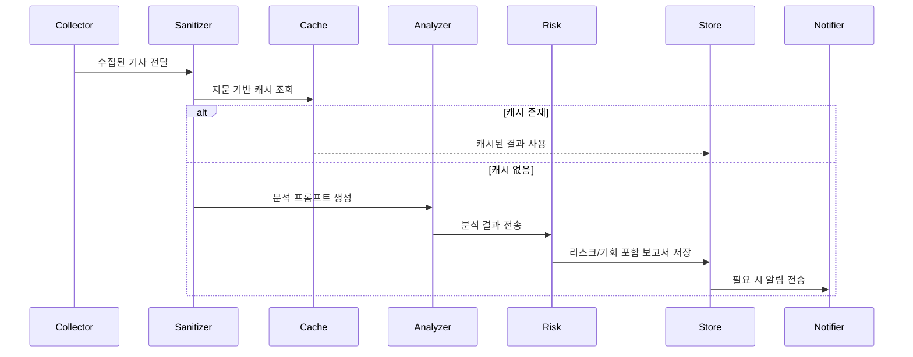

# MarketWiseAgent — 아키텍처 개요

목적
- 이 문서는 `MarketWiseAgent`의 전체 아키텍처, 구성 요소, 데이터 흐름과 확장 포인트를 간략히 설명합니다. 포트폴리오에 포함하기에 적절한 수준의 기술 설명을 제공합니다.

핵심 아이디어
- 목표: 미국 증시 관련 뉴스를 수집하여 LLM 기반 분석을 수행하고, 그 결과를 저장·알림하는 소형 에이전트 파이프라인
- 설계 원칙: 단순성, 모듈화(Collector → Sanitizer → Analyzer → Cache → Notifier), 재현성

주요 구성 요소
- News Collector: `utils/news_fetcher.py` — NewsAPI 등을 이용해 기사 수집
- Data Sanitizer: `utils/security.py`의 `sanitize_articles()` — 입력 검증 및 프롬프트 인젝션 방어
- Analyzer: `utils/ai_analyzer.py` — 프롬프트 템플릿을 구성하고 LLM(현재 OpenAI)으로 요약/인사이트 생성
- Risk Assessor: `utils/ai_analyzer.py`의 리스크 프롬프트 — 분석 결과 기반 리스크·기회 평가
- Semantic Cache: `utils/semantic_cache.py` — 동일한 뉴스 세트에 대해 재분석 방지를 위한 캐시(지문 기반)
- Orchestrator / Agent: `agent/us_market_agent.py` — 전체 워크플로우(수집→정제→분석→저장→알림)를 조율
- Notifier: `utils/email_sender.py` — 결과를 이메일로 전송(옵션)
- Config: `config/settings.py` — 환경 변수 및 상수

데이터 흐름 (요약)
1. 수집: `NewsCollectorAgent`가 `get_us_market_news()`를 호출해 기사 목록을 가져옵니다.
2. 정제: `NewsSanitizerAgent`가 `sanitize_articles()`로 불필요하거나 위험한 텍스트를 제거합니다.
3. 캐시 검사: `SemanticCacheManager.make_fingerprint()`로 기사 집합의 지문을 만들어 기존 분석 결과를 조회합니다.
4. 분석: 캐시 미스 시 `summarize_news_with_insight()` → LLM 호출로 주요 뉴스 5개 선별, 요약 및 인사이트 생성.
5. 리스크 평가: `assess_risk_and_opportunity()`로 별도 프롬프트를 통해 리스크·기회를 추출.
6. 저장: 분석 결과를 텍스트 파일로 저장하고, 캐시에도 저장하여 다음 요청에서 재사용.
7. 알림: 조건에 따라 `send_to_email()`로 보고서를 전송.

간단한 시퀀스 다이어그램

배포 및 실행
- 로컬: `python main.py`로 전체 파이프라인 실행
- 배치: cron이나 작업 스케줄러로 주기 실행
- 프로덕션: 컨테이너화(Docker) 후 클라우드(예: ECS, GKE, Lambda + EventBridge)로 배포 가능

보안 및 운영 고려사항
- 비밀 관리: API 키와 이메일 자격증명은 `.env` 또는 비밀 매니저(예: AWS Secrets Manager)에 보관
- 비용 관리: LLM 호출 비용 추적(코드 내 `LLMCostTracker`) 기반으로 사용량 모니터링
- 신뢰성: 외부 API(NewsAPI, SMTP) 실패에 대비한 재시도와 예외 처리 추가 권장
- 프롬프트 인젝션 방어: 입력 텍스트 정제와 시스템 프롬프트 제한(`utils/security.py`) 유지

확장 아이디어
- 실시간 스트리밍(트위터/X) 수집기 추가
- 결과를 시각화하는 대시보드(Flask/FastAPI + React)
- 멀티모델 전략: 빠른 경량 모델으로 초안 생성 후 고품질 모델로 정제

참고 소스 파일
- `main.py`, `agent/us_market_agent.py`, `utils/news_fetcher.py`, `utils/ai_analyzer.py`, `utils/semantic_cache.py`, `utils/email_sender.py`, `config/settings.py`

---

원하시면 이 문서를 더 다듬어 포트폴리오용 설명(짧은 요약 + 기술 스택, 스크린샷 포함)으로 만들겠습니다.
